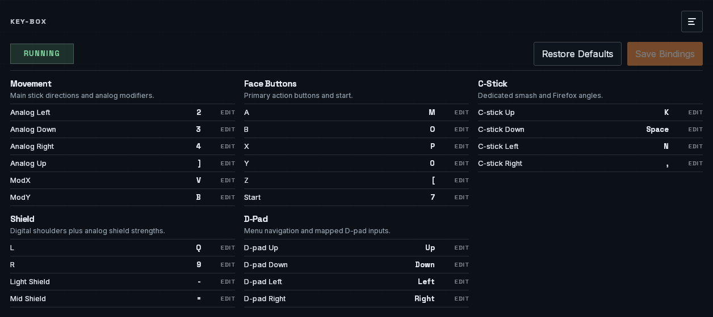

# key-b0x

`key-b0x` is a desktop app for playing Slippi on keyboard on Windows and Linux.
It writes directly to Slippi's pipe controller backend, so you do not have to
set up a virtual gamepad, old drivers, or AutoHotkey just to get started.
It builds on earlier work from
[agirardeau/b0xx-ahk](https://github.com/agirardeau/b0xx-ahk) and
[JonnyHaystack/HayBox](https://github.com/JonnyHaystack/HayBox).

Right now `key-b0x` is focused on Slippi / Ishiiruka.



## Download

1. Open the [latest release](https://github.com/arismoko/key-b0x/releases/latest).
2. Click `Assets` if the files are collapsed.
3. Download the file for your platform:

- Windows: `key-b0x_*_windows_x64-setup.exe`
- Linux: `key-b0x_*_linux_x86_64.AppImage`

If you just want to use the app, you do not need to build anything in this
repository.

## Quick Start

1. Download and open `key-b0x`.
2. Confirm your Slippi user folder in the app and continue. `key-b0x` installs
   its controller profile for you.
3. In Dolphin / Ishiiruka, open the controller settings, set Port 1 to
   `Standard Controller`, select the `key-b0x` profile, and press `Load`.
4. Run the keyboard test and make sure your intended key combinations all show
   up at the same time.
5. Start Slippi and play.

## Why Use It?

- One desktop app instead of a multi-step driver and script setup
- Guided onboarding for Slippi path detection, profile install, and keyboard
  testing
- In-app rebinding for controls and runtime settings
- Built-in update checks and in-app updates
- Native support for Windows and Linux

## Need Help?

- [Getting started and troubleshooting](docs/getting-started.md)
- [Architecture notes](docs/architecture.md)
- [Maintainer release runbook](docs/releasing.md)

## Development

```bash
cd apps/desktop
npm install
npm run dev
```

Useful commands:

- `npm run typecheck`
- `npm run test`
- `npm run build`

Release builds use `npm run build`, which delegates to `tauri build`.

For the Rust/Tauri layout, see [docs/architecture.md](docs/architecture.md).

## Notes

- The app captures from all active keyboards in the current session.
- Linux in-app updates work best when the AppImage stays in a stable writable
  location such as `~/Applications/key-b0x.AppImage`.
